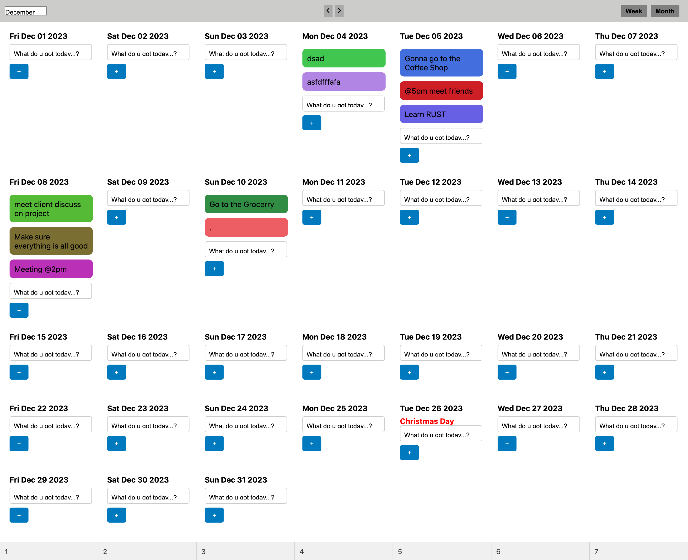

# Calendar Task Organizer

## Description

This Calendar Task Organizer is a dynamic web application that allows users to create and manage tasks in a calendar grid format. It features a variety of functionalities to enhance productivity and organization.

## Features

- **Task Management**: Create and edit tasks directly inside calendar cells.
- **Label Management**: Create and edit/update  tasks, including color and text options.
- **Drag Re-arrange Tasks**: Drag and Re-arrange  tasks in a cell.
- **Label Assignment**: Assign multiple labels to a task.
- **Label-Based Filtering**: Label tasks by their colour labels.
- **Data Import/Export**: Import and export calendar data in JSON or other formats.
- **Download Calendar**: Ability to download the calendar view as an image /png.
- **Worldwide Holidays**: Display worldwide holidays for each day in the calendar, using data from [Nager.Date API](https://date.nager.at/swagger/index.html).
- **Fixed Holiday Names**: Holiday names are displayed at the top of each cell and are not affected by task reordering.

## Technologies Used

- React with TypeScript
- react-beautiful-dnd for drag-and-drop functionality
- CSS-in-JS (Emotion/Styled-Components/Stitches) for styling
- html2canvas for exporting the calendar screen as png
- API integration for fetching public national holidays


## Setup and Installation

1. Clone the repository:
   ```
   git clone https://github.com/mulsewm/my-calendar
   ```
2. Navigate to the project directory:
   ```
   cd my-calendar
   ```
3. Install dependencies:
   ```
   npm install
   ```
4. Run the application:
   ```
   npm start
   ```

## Contributing

Contributions to the Calendar Task Organizer are welcome. Please follow these steps to contribute:

1. Fork the repository.
2. Create a new branch: `git checkout -b master`.
3. Make your changes and commit them: `git commit -m 'Added some features'`.
4. Push to the original branch: `git push origin master`.
5. Create the pull request.

Alternatively, see the GitHub documentation on [creating a pull request](https://help.github.com/articles/creating-a-pull-request/).

## License

This project is licensed under [MIT License](LICENSE).
